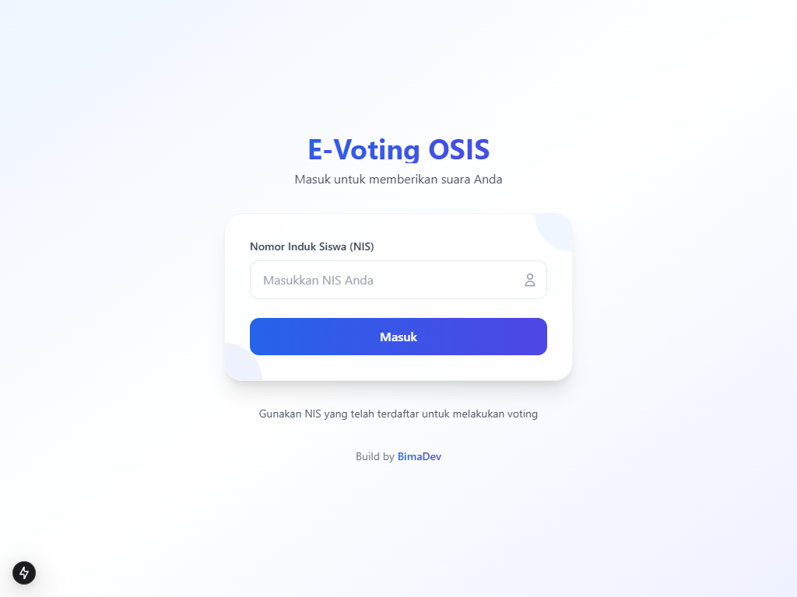

# PilihKu - Sistem E-Voting OSIS

PilihKu adalah aplikasi e-voting modern untuk pemilihan ketua dan wakil ketua OSIS di sekolah. Dibangun dengan Next.js 14, Supabase, Tailwind CSS, dan berbagai teknologi modern lainnya.

## 📸 Preview

<div align="center">
  <h3>Halaman Login</h3>
  
  
  <h3>Halaman Voting</h3>
  
  
  <h3>Dashboard Admin</h3>
  
  
  <h3>Manajemen Kandidat</h3>
  
  
  <h3>Hasil Voting</h3>
  
  
  <h3>Pengumuman Pemenang</h3>
  
</div>

## 🌟 Fitur Utama

### Untuk Pemilih
- Login dengan NIS
- Melihat profil lengkap kandidat (foto, visi, misi)
- Melakukan voting dengan konfirmasi
- Halaman terima kasih setelah voting
- Tidak bisa voting lebih dari sekali
- Tampilan responsif untuk mobile dan desktop

### Untuk Admin
- Dashboard admin yang komprehensif dengan statistik real-time
- Manajemen data kandidat (CRUD)
- Manajemen data pemilih (CRUD)
- Import data pemilih via CSV
- Monitoring hasil voting real-time
- Export hasil dalam format CSV
- Cetak laporan hasil pemilihan
- Pengaturan waktu pengumuman pemenang
- Pengumuman pemenang otomatis berdasarkan suara terbanyak
- Reset pengaturan pengumuman

### Fitur Pengumuman
- Countdown timer untuk pengumuman pemenang
- Tampilan animasi dan confetti saat pengumuman
- Pengumuman otomatis pada waktu yang ditentukan
- Pemenang ditentukan berdasarkan jumlah suara terbanyak
- Pengumuman bisa direset atau dihapus


## 🛠 Teknologi yang Digunakan

- **Frontend**:
  - Next.js 14 (App Router)
  - React & TypeScript
  - Tailwind CSS
  - Framer Motion (animasi)
  - React Icons

- **Backend & Database**:
  - Supabase (Database, Auth, Storage)
  - Row Level Security (RLS)

- **Visualisasi Data**:
  - Chart.js

- **Utilitas**:
  - Papa Parse (CSV parsing)


## 📋 Prasyarat

- Node.js versi 18.0.0 atau lebih tinggi
- NPM atau Yarn
- Akun Supabase

## 🚀 Cara Instalasi

1. Clone repository
```bash
git clone https://github.com/bimadevs/pilihku-E-Voting.git
cd pilihku
```

2. Install dependencies
```bash
npm install
# atau
yarn install
```

3. Setup environment variables
```bash
cp .env.example .env.local
```

4. Isi environment variables di .env.local
```bash
NEXT_PUBLIC_SUPABASE_URL=your_supabase_url
NEXT_PUBLIC_SUPABASE_ANON_KEY=your_supabase_anon_key
```

5. Jalankan aplikasi
```bash
npm run dev
# atau
yarn dev
```

## 💾 Struktur Database
> Copy dan paste ke supabase SQL Editor

### Tabel `voters`
```sql
create table public.voters (
  id uuid not null default extensions.uuid_generate_v4 (),
  nis text not null,
  full_name text not null,
  class text not null,
  has_voted boolean null default false,
  created_at timestamp with time zone not null default timezone ('utc'::text, now()),
  constraint voters_pkey primary key (id),
  constraint voters_nis_key unique (nis)
) TABLESPACE pg_default;
```

### Tabel `candidates`
```sql
create table public.candidates (
  id uuid not null default extensions.uuid_generate_v4 (),
  candidate_number integer not null,
  ketua_name text not null,
  wakil_name text not null,
  visi text not null,
  misi text not null,
  photo_url text null,
  created_at timestamp with time zone not null default timezone ('utc'::text, now()),
  ketua_photo_url text null,
  wakil_photo_url text null,
  ketua_class text null,
  wakil_class text null,
  program_kerja text null,
  constraint candidates_pkey primary key (id)
) TABLESPACE pg_default;

create unique INDEX IF not exists candidates_candidate_number_key on public.candidates using btree (candidate_number) TABLESPACE pg_default;
```

### Tabel `votes`
```sql
create table public.votes (
  id uuid not null default extensions.uuid_generate_v4 (),
  voter_id uuid null,
  candidate_id uuid null,
  created_at timestamp with time zone not null default timezone ('utc'::text, now()),
  constraint votes_pkey primary key (id),
  constraint votes_candidate_id_fkey foreign KEY (candidate_id) references candidates (id),
  constraint votes_voter_id_fkey foreign KEY (voter_id) references voters (id)
) TABLESPACE pg_default;
```

### Tabel `voting_schedule`
```sql
create table public.voting_schedule (
  id uuid not null default extensions.uuid_generate_v4(),
  start_time timestamp with time zone not null,
  end_time timestamp with time zone not null,
  is_active boolean not null default true,
  created_at timestamp with time zone not null default timezone('utc'::text, now()),
  constraint voting_schedule_pkey primary key (id)
) tablespace pg_default;

-- Hanya satu jadwal yang bisa aktif
create unique index if not exists voting_schedule_active_idx on public.voting_schedule (is_active) where (is_active = true);

-- RLS Policies untuk voting_schedule
alter table public.voting_schedule enable row level security;

-- Policy untuk membaca jadwal (publik)
create policy "Jadwal dapat dibaca oleh semua pengguna"
on public.voting_schedule for select
to public
using (true);

-- Policy untuk menambah/mengubah jadwal (admin only)
create policy "Hanya admin yang dapat mengatur jadwal"
on public.voting_schedule for all
to authenticated
using (true)
with check (true);
```

### Tabel `settings`
```sql
create table public.settings (
  id uuid not null default extensions.uuid_generate_v4 (),
  announcement_time timestamp with time zone null,
  winner_id uuid null,
  created_at timestamp with time zone null default timezone ('utc'::text, now()),
  updated_at timestamp with time zone null default timezone ('utc'::text, now()),
  constraint settings_pkey primary key (id),
  constraint settings_winner_id_fkey foreign KEY (winner_id) references candidates (id) on delete set null
) TABLESPACE pg_default;
```

### Storage Bucket
> Copy dan paste ke supabase SQL Editor untuk membuat bucket penyimpanan foto

```sql
-- Buat bucket untuk foto kandidat
insert into storage.buckets (id, name, public) 
values ('candidate-photos', 'candidate-photos', true);

-- Atur security policies untuk bucket candidate-photos
create policy "Foto kandidat dapat diakses publik"
on storage.objects for select
using ( bucket_id = 'candidate-photos' );

create policy "Hanya admin yang dapat menambah foto kandidat"
on storage.objects for insert
with check (
  bucket_id = 'candidate-photos' 
  and auth.role() = 'authenticated'
);

create policy "Hanya admin yang dapat menghapus foto kandidat"
on storage.objects for delete
using (
  bucket_id = 'candidate-photos'
  and auth.role() = 'authenticated'
);
```

Konfigurasi bucket ini untuk:
- Akses publik untuk melihat foto kandidat
- Hanya admin yang dapat mengunggah foto baru
- Hanya admin yang dapat menghapus foto

## 📝 Panduan Penggunaan

### Untuk Admin

1. **Login Admin**
   - Akses halaman `/admin`
   - Login menggunakan kredensial admin

2. **Mengelola Kandidat**
   - Buka menu "Kandidat"
   - Tambah/edit/hapus data kandidat
   - Upload foto kandidat
   - Isi visi dan misi

3. **Mengelola Pemilih**
   - Buka menu "Pemilih"
   - Tambah pemilih satu per satu
   - Import data pemilih via CSV
   - Format CSV: nis,full_name,class

4. **Melihat Hasil**
   - Buka menu "Hasil"
   - Lihat statistik real-time
   - Export hasil ke CSV
   - Cetak laporan

5. **Pengaturan Pengumuman**
   - Buka menu "Pengaturan"
   - Atur waktu pengumuman pemenang
   - Lihat hasil voting sementara
   - Reset pengaturan jika diperlukan

### Untuk Pemilih

1. **Login**
   - Masukkan NIS
   - Sistem akan memverifikasi kesesuaian data

2. **Memilih**
   - Lihat profil lengkap kandidat
   - Klik "Pilih" pada kandidat yang diinginkan
   - Konfirmasi pilihan
   - Setelah memilih, tidak bisa mengubah pilihan

3. **Melihat Pengumuman**
   - Tunggu hingga waktu pengumuman
   - Lihat countdown timer
   - Lihat pengumuman pemenang dengan animasi

## 🔒 Keamanan

- Autentikasi berbasis token
- Row Level Security (RLS) di Supabase
- Validasi input di frontend dan backend
- Pencegahan double voting
- Enkripsi data sensitif
- Session management

## 📊 Format CSV

### Import Pemilih
```csv
nis,full_name,class
12345,Nama Siswa 1,XII RPL 1
12346,Nama Siswa 2,XI TKJ 2
```

### Export Hasil
```csv
Statistik Pemilihan OSIS
Total Pemilih,100
Sudah Memilih,75
Belum Memilih,25
Persentase Partisipasi,75%

Hasil Per Kandidat
Nomor Urut,Ketua,Wakil,Jumlah Suara,Persentase
1,Ketua 1,Wakil 1,40,53.3%
2,Ketua 2,Wakil 2,35,46.7%
```

## 🤝 Kontribusi

Kontribusi selalu diterima dengan senang hati. Untuk kontribusi besar, silakan buka issue terlebih dahulu untuk mendiskusikan perubahan yang diinginkan.

## 📄 Lisensi

[MIT License](LICENSE)

## 👥 Tim Pengembang

- [Bima Jovanta](https://github.com/bimadevs)

## 📞 Kontak

Untuk pertanyaan dan dukungan, silakan hubungi:
- Email: bimaj0206@gmail.com
- Website: https://bimadev.xyz

## 🙏 Ucapan Terima Kasih

Terima kasih kepada tuhan yang maha esa 
